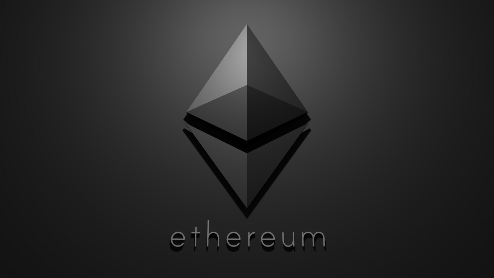

# Smart contracts for the optimistic rollup 

  

# Notice 

** This is the skeleton code showing the general idea and is not meant to be used in production. **

# Overview of the Celer Sidechain
The various roles in the Celer Sidechain system consist of:

# Users
- Sidechain block producers

- Sidechain block validators

- Rollup transaction aggregators

- Rollup transaction validators

# Description

Users interact with other users and dApps on the Celer sidechain much like how they interact with the Ethereum mainchain, except that they will enjoy short block confirmation time and cheap transaction fees payable in the form of CELR tokens. The fees will be used to reward the other roles in the system.

Sidechain block producers run a small group of modified Ethereum nodes under a fast Proof-of-Authority (PoA) consensus. They process general EVM transactions and produce sidechain blocks. They will be required to stake a significant number of CELR tokens and will need to provide high availability and reliability.

Sidechain block validators are a relatively large group of nodes that also stake CELR tokens. Their job is to watch and validate the sidechain blocks as they are produced. Every few blocks, they reach consensus on a checkpoint of multiple blocks via a Proof-of-Stake (PoS) consensus. Sidechain block validators provide finality for general EVM transactions. They are also responsible for the governance of the block producers and will vote on slashing them in case of malicious behavior.

Rollup transaction aggregators listen to the rollup-related contract events emitted on the sidechain. They build rollup transactions from the events and submit rollup blocks to the mainchain periodically. Note that we made the design choice of letting the aggregators process contract events instead of accepting transactions from users directly to provide seamless user and developer experience. Any node that has placed a certain number of CELR tokens as a bond can operate as an aggregator. 

Only one aggregator is needed (and allowed) to submit each rollup block and there is no need for consensus among them. Therefore, we have more flexibility in choosing the aggregator. Initially, we can simply do a round-robin selection among the validators. In the future, we could incorporate an even more decentralized aggregator pool via mechanisms such as a Proof-of-Burn (PoB) auction. The auction picks the aggregator that is willing to burn the most number of CELR tokens, which incentivizes honesty and non-censorship and reduces the possibility of spamming.

Rollup transaction validators watch the submitted rollup blocks and try to find invalid state roots in them. Upon a successful challenge, half of the malicious aggregator's bond is burnt and the other half goes to the validator as a bounty. Any aggregator that built on top of the invalid block will also be slashed, and the sidechain is rolled back to before the invalid block.

# Optimistic Rollup for ERC-20 Tokens

The Celer Sidechain provides optimistic rollup for ERC-20 assets mapped from the mainchain. Any mainchain ERC-20 token can be mapped onto the Celer sidechain via the token registry contracts. Upon the completion of the mapping transaction, one of the sidechain validators will deploy a modified ERC-20 contract on the sidechain.

# Note 

We modified the standard ERC-20 contract to emit necessary data for rollup. In particular, we changed the transfer() function to require an extra signature parameter for rollup fraud proofs. The contract also tracks nonce for each account to prevent double spending.

# The state storage 

In the rollup chain tracks the balances and nonces for the list of tokens owned by each account. We have implemented three types of state transitions: deposit, withdrawal and transfer.

# A deposit transition 

Initiated when a user deposits into the deposit / withdraw manager contract on the mainchain. One of the sidechain validators will collect more than 2/3 votes from all the validators and submit a deposit transaction on the sidechain to reflect the state change on the mainchain. Note that we defer to the PoS validators to synchronize the deposits instead of modifying the state roots on mainchain directly. We made this small trade-off about security to allow easier sequencing of transactions, to avoid having to pause token transfers, and to provide higher deposit throughput.

# A withdrawal transition 

Initiated by the user on the sidechain to reduce the balance of a token owned by the user. The reduced amount is burnt on the sidechain. After the rollup block containing the withdrawal transition is submitted to the mainchain and the challenge period has passed, the withdrawal is finalized. Now the user can submit a withdrawal transaction to the deposit / withdraw manager contract on the mainchain to claim the funds.

# A transfer transition 

Simply reduces the balance of the sender and increases that of the recipient.

Currently, a part of our rollup implementation is modified from the Unipig demo by the Plasma Group. We are actively looking into technologies like the Optimistic Virtual Machine (OVM) and intend to support generalized optimistic rollup for all types of smart contracts in the future.
